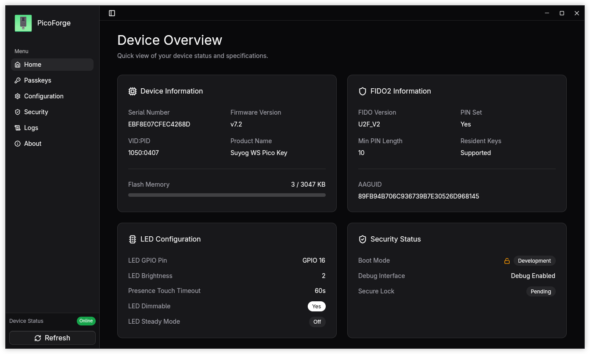
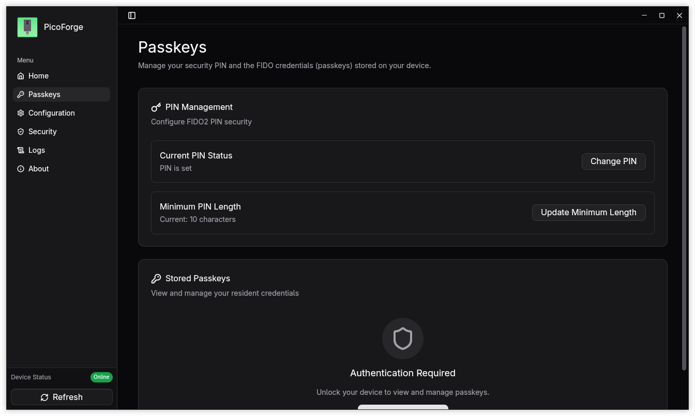
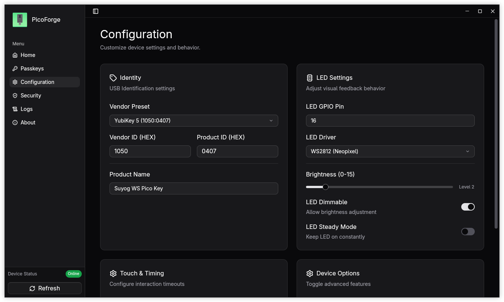

<div align="center">

# PicoForge


**An open source commissioning tool for Pico FIDO security keys**

[](https://www.gnu.org/licenses/agpl-3.0)
[](https://github.com/librekeys/picoforge/issues)

[](https://copr.fedorainfracloud.org/coprs/lockedmutex/picoforge/package/picoforge/)
[](https://github.com/librekeys/picoforge/stargazers)

</div>

> [!IMPORTANT]
> PicoForge is an independent, community-developed tool and is not affiliated with or endorsed by the official [pico-fido](https://github.com/polhenarejos/pico-fido) project. 
> This software does not share any code with the official closed-source pico-fido application.
>
> Check application [Installation Wiki](https://github.com/librekeys/picoforge/wiki/Installation) for installation guide of the PicoForge app on your system.

## About

PicoForge is a modern desktop application for configuring and managing Pico FIDO security keys. Built with Rust, Tauri, and Svelte, it provides an intuitive interface for:

- Reading device information and firmware details
- Configuring USB VID/PID and product names
- Adjusting LED settings (GPIO, brightness, driver)
- Managing security features (secure boot, firmware locking) (WIP)
- Real-time system logging and diagnostics
- Support for multiple hardware variants and vendors

> **Alpha Status**: This application is currently under active development and in alpha stage. Users should expect bugs and are encouraged to report them. The app has been tested on Linux and Windows 10 with the official Raspberry Pi Pico2 & ESP32-S3 and, currently supports Pico FIDO firmware version 7.2 only.

## Screenshots

<div align="center">

### Main Interface


### Configuration Panel

#### Pin config


#### Other Config


</div>

## Features

- **Device Configuration** - Customize USB identifiers, LED behavior, and hardware settings
- **Security Management** - Enable secure boot and firmware verification (experimental and WIP)
- **Real-time Monitoring** - View flash usage, connection status, and system logs
- **Modern UI** - Clean, responsive interface built with Svelte and shadcn-svelte
- **Multi-Vendor Support** - Compatible with multiple hardware variants
- **Cross-Platform** - Works on Windows, macOS, and Linux

## Installation

Check the official [PicoForge Wiki](https://github.com/librekeys/picoforge/wiki/Installation) for installation info of the application.

## Usage

1. Connect your smart card reader
2. Insert your Pico FIDO device
3. Launch PicoForge
4. Click **Refresh** button at top right corner to detect your key
5. Navigate through the sidebar to configure settings:
   - **Home** - Device overview and quick actions
   - **Configuration** - USB settings, LED options
   - **Security** - Secure boot management (experimental)
   - **Logs** - Real-time event monitoring
   - **About** - Application information

## Requirements

### Development Requirements

To contribute to PicoForge, you'll need:

- **[Node.js](https://nodejs.org/)** - JavaScript/TypeScript runtime
- **[Deno](https://deno.land/)** - JavaScript/TypeScript runtime
- **[Rust](https://www.rust-lang.org/)** - System programming language (1.80+)
- **PC/SC Middleware**:
  - Linux: `pcscd` (usually pre-installed)
  - macOS: Built-in
  - Windows: Built-in

## Building from Source

### 1. Clone the Repository

```bash
git clone https://github.com/librekeys/picoforge.git
cd picoforge
```

### 2. Install Dependencies

#### Using Deno (Recommended)

```bash
deno install
```

#### Using npm

```bash
npm install
```

### 3. Build the Application

#### Development Build

**With Deno:**
```bash
deno task tauri dev
```

**With npm:**
```bash
npm run tauri dev
```

#### Production Build

**With Deno:**
```bash
deno task tauri build
```

**With npm:**
```bash
npm run tauri build
```

The compiled binaries will be available in:
- **Linux**: `src-tauri/target/release/bundle/`
- **macOS**: `src-tauri/target/release/bundle/dmg/`
- **Windows**: `src-tauri/target/release/bundle/`

## Building and Development with Nix

[Nix](https://nixos.org/) provides developers with a complete and consistent development environment.

You can use Nix to build and develop picoforge painlessly.

### 1. Install Nix

Follow the [Installation Guide](https://nixos.org/download/#download-nix) and [NixOS Wiki](https://wiki.nixos.org/wiki/Flakes#Setup) to install Nix and enable Flakes.

### 2. Build & Run

You can build and run PicoForge with a single command:

```bash
nix run github:librekeys/picoforge
```

Or simply build it and link to the current directory:

```bash
nix build github:librekeys/picoforge
```

### 3. Develop
Alternatively, you can enter a developement environement with all the required dependencies by running:

```bash
nix develop github:librekeys/picoforge
```

Or use the shell.nix file that is at the root of the repository:

```bash
nix-shell
```

Then you can build from source and run the application with:

```bash
deno task tauri dev
```

## Project Structure

```
picoforge/
├── src/                      # Svelte frontend
│   ├── lib/                  # Reusable components & utilities
│   │   ├── components/       # UI components
│   │   ├── device/           # Device-related logic
│   │   ├── hooks/            # Custom Svelte hooks
│   │   ├── layout/           # Layout components
│   │   ├── services/         # Service layer
│   │   ├── state/            # State management
│   │   ├── utils.ts          # Utility functions
│   │   └── views/            # View components
│   ├── routes/               # SvelteKit pages
│   │   ├── +layout.svelte    # Root layout
│   │   ├── +layout.ts        # Layout configuration
│   │   └── +page.svelte      # Home page
│   ├── app.css               # Global styles
│   └── app.html              # HTML template
├── src-tauri/                # Rust backend
│   ├── src/                  # Rust source code
│   │   ├── fido/             # FIDO device logic
│   │   ├── rescue/           # Rescue mode functionality
│   │   ├── error.rs          # Error handling
│   │   ├── io.rs             # I/O operations
│   │   ├── lib.rs            # Tauri commands & PC/SC logic
│   │   ├── logging.rs        # Logging utilities
│   │   ├── main.rs           # Entry point
│   │   └── types.rs          # Type definitions
│   ├── icons/                # Application icons
│   ├── capabilities/         # Tauri permissions
│   │   └── default.json      # Default capabilities
│   ├── Cargo.toml            # Rust dependencies
│   ├── Cargo.lock            # Rust lock file
│   ├── tauri.conf.json       # Tauri configuration
│   ├── build.rs              # Build script
│   └── rustfmt.toml          # Rust formatting config
├── static/                   # Static assets
│   ├── build-configure-symbolic.svg
│   ├── favicon.png
│   ├── in.suyogtandel.picoforge.svg
│   ├── svelte.svg
│   ├── tauri.svg
│   └── vite.svg
├── data/                     # Application data
│   ├── in.suyogtandel.picoforge.desktop
│   └── screenshots/          # Screenshots
├── node_modules/             # Deno node compatibility modules
├── components.json           # shadcn-svelte config
├── package.json              # Node package manifest
├── package-lock.json         # npm lock file
├── deno.json                 # Deno configuration
├── deno.lock                 # Deno lock file
├── svelte.config.js          # SvelteKit configuration
├── vite.config.js            # Vite bundler config
├── tsconfig.json             # TypeScript configuration
├── biome.json                # Biome configuration
├── CREDITS.md                # Credits
└── LICENSE                   # AGPL-3.0 license
```

## Contributing

Contributions are welcome (REALLY NEEDED, PLEASE HELP ME)! Please follow these steps:

1. Fork the repository
2. Create a feature branch (`git checkout -b feature/amazing-feature`)
3. Commit your changes (`git commit -m 'Add amazing feature'`)
4. Push to the branch (`git push origin feature/amazing-feature`)
5. Open a Pull Request

### Development Guidelines

- Follow Rust and TypeScript best practices
- Use `deno fmt` to format the frontend code
- Write clear commit messages
- Update documentation for new features
- Test on multiple platforms when possible

## License

This project is licensed under the **GNU Affero General Public License v3.0 (AGPL-3.0-only)**.

See [LICENSE](LICENSE) for full details.

## Maintainers

- **Suyog Tandel** ([@lockedmutex](https://github.com/lockedmutex))

## Support

- **Discord**: [Join our Discord server](https://discord.gg/6wYBpSHJY2) for community support and interaction
- **Issues**: [GitHub Issues](https://github.com/librekeys/picoforge/issues)
- **Discussions**: [GitHub Discussions](https://github.com/librekeys/picoforge/discussions)

## Disclaimer

> [!WARNING]
> PicoForge is experimental software and still in the Alpha stage! 
> The app does contain bugs and is not secure by any means.
>
> It does not support all the features exposed by the `pico-fido` firmware and `pico-hsm`.
>
> The secure boot feature can permanently lock devices if misconfigured. Always understand the implications before enabling security features.

> [!CAUTION]
> **USB VID/PID Notice**: The vendor presets provided in this software include USB Vendor IDs (VID) and Product IDs (PID) that are the intellectual property of their respective owners. These identifiers are included for testing and educational purposes only. You are NOT authorized to distribute or commercially market devices using VID/PID combinations you do not own or license. Commercial distribution requires obtaining your own VID from the USB Implementers Forum ([usb.org](https://www.usb.org/getting-vendor-id)) and complying with all applicable trademark and certification requirements. Unauthorized use may violate USB-IF policies and intellectual property laws. The PicoForge developers assume no liability for misuse of USB identifiers.

---

<div align="center">

**Made with ❤️ by the LibreKeys community**

Copyright © 2026 Suyog Tandel

</div>
